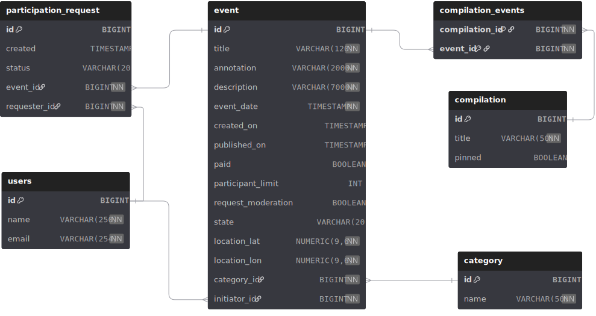
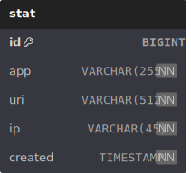

# Explore With Me

Социальная сеть для публикации интересных событий и поиска компании для участия в них. Написана на Java / Spring Boot.

## Участники команды

[LightInTheFire](https://github.com/LightInTheFire)  
[Basarus](https://github.com/Basarus)  
[Kreidl](https://github.com/Kreidl)

---

## Архитектура

Приложение построено как микросервисная система. Все сервисы регистрируются в Eureka и взаимодействуют через OpenFeign. Внешние запросы принимает API-шлюз.

```text
Клиент
  │
  ▼
gateway-server  :8080  — Spring Cloud Gateway, маршрутизирует запросы к сервисам
  ├── user-service        :8081  — управление пользователями
  ├── event-service       :8082  — события и категории
  ├── request-service     :8083  — заявки на участие
  └── compilation-service :8084  — подборки и комментарии

discovery-server  :8761  — реестр сервисов Eureka (все сервисы регистрируются здесь)
config-server     :8888  — Spring Cloud Config, раздаёт конфигурации из
                           infra/config-server/src/main/resources/config/
stats-server      :9090  — статистика просмотров (отдельная БД)
```

### Ответственность сервисов

- **user-service** — `GET/POST/DELETE /admin/users`
- **event-service** — `/admin/events`, `/admin/categories`, `/events`, `/categories`, `/users/*/events`
- **request-service** — `/users/*/requests`, `/users/*/events/*/requests`
- **compilation-service** — `/admin/compilations`, `/compilations`, `/admin/comments`, `/users/*/comments`, `/events/*/comments`
- **stats-server** — `/hit`, `/stats`

### Конфигурация

Централизованная конфигурация хранится в `infra/config-server/src/main/resources/config/`:

- `application.yml` — общие настройки для всех сервисов
- `user-service.yml`, `event-service.yml`, `request-service.yml`, `compilation-service.yml` — настройки отдельных сервисов
- `gateway-server.yml` — таблица маршрутизации шлюза

---

## Внутреннее API

Сервисы общаются через внутренние эндпоинты с префиксом `/internal`. Они не доступны через шлюз.

### user-service

| Метод | Путь                          | Описание                              |
| ----- | ----------------------------- | ------------------------------------- |
| GET   | /internal/users/{id}          | Получить пользователя по ID           |
| GET   | /internal/users?ids=1,2,3     | Получить нескольких пользователей     |

**Используется:** event-service, request-service, compilation-service

---

### event-service

| Метод | Путь                                    | Описание                              |
| ----- | --------------------------------------- | ------------------------------------- |
| GET   | /internal/events/{id}                   | Получить событие по ID                |
| GET   | /internal/events?ids=1,2,3              | Получить несколько событий            |
| GET   | /internal/events/compilation?ids=1,2,3  | Получить данные событий для подборок  |

**Используется:** request-service, compilation-service

---

### request-service

| Метод | Путь                                          | Описание                                         |
| ----- | --------------------------------------------- | ------------------------------------------------ |
| GET   | /internal/requests/confirmed-counts?eventIds= | Количество подтверждённых заявок по событиям     |

**Используется:** event-service, compilation-service

---

### compilation-service

| Метод | Путь                               | Описание                              |
| ----- | ---------------------------------- | ------------------------------------- |
| GET   | /internal/comments/count?eventIds= | Количество комментариев по событиям   |

**Используется:** event-service

---

## Внешнее API

Полная спецификация API:

- [API основного сервиса](ewm-main-service-spec.json)
- [API сервиса статистики](ewm-stats-service-spec.json)

---

## Схемы БД

### Основной сервис

<p align="center">
  
</p>

### Сервис статистики

<p align="center">
  
</p>
